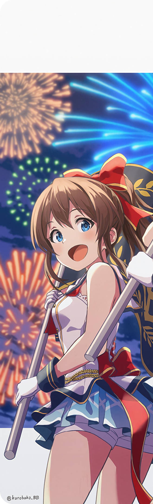

<h1 align="center" justify="center">こんにちは！ Welcome to My Github </h1>

	 
  

  
 

	<a href="https://github.com/negpastalia">negpastalia</a> |
	<a href="https://github.com/shigeru22">Shigeru</a> |
	<a href="https://github.com/Itsakaseru">Itsakaseru</a> |
	<a href="https://github.com/afrisanjaya">Afri</a> |
	<a href="https://github.com/Andrioeffendi31">Kuma</a>

	Collab Art by <a href="https://twitter.com/kurobako_BB">クロ箱</a>

 
 
